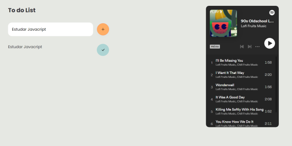
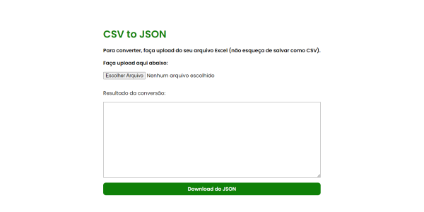
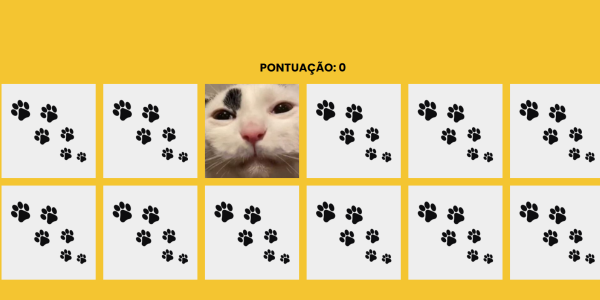
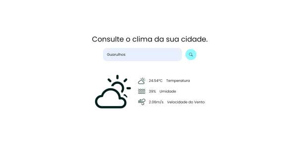

# Olá, tudo bem?

**Seja bem-vindx ao repositório de projetos front-end!**

Cada mini projeto aqui foi construído para **aprimorar minhas habilidades de desenvolvimento front-end**.
 
 **Fique a vontade para explorar!**

## Tecnologias usadas até agora
   

## Sumário de projetos
1. **relogio-js:**  relógio online com aparência de uma janela de MacOS.
2. **to-do-list:** lista de tarefas com acesso a uma playlist do Spotify.
3. **csv-to-json:** conversor de arquivo .csv para json.
4. **memory-game:** jogo da memória com imagens engraçadas de gatos.
5. **clima-tempo:** consulta de tempo, uso da Open Weather API.

## Relógio digital com aparência de janela MacOS
 
<a href="https://sarahsoaressilva.github.io/frontend-repositorio/relogio-js/relogio.html" target="_blank"> Clique aqui para acessar o projeto </a>

## To do list com Spotify
 
<a href="https://sarahsoaressilva.github.io/frontend-repositorio/to-do-list/todolist.html" target="_blank"> Clique aqui para acessar o projeto </a>

## Conversor CSV para Json
 
<a href="https://sarahsoaressilva.github.io/frontend-repositorio/csv-to-json/index.html" target="_blank"> Clique aqui para acessar o projeto </a>

## Jogo da memória com imagens de memes de gatos
 
<a href="https://sarahsoaressilva.github.io/frontend-repositorio/memory-game/memory.html" target="_blank"> Clique aqui para acessar o projeto </a>

## Consulta de Clima com a Open Weather API
 
<a href="https://sarahsoaressilva.github.io/frontend-repositorio/clima-tempo/clima.html" target="_blank"> Clique aqui para acessar o projeto </a>
